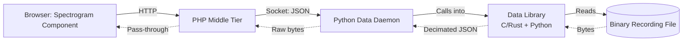
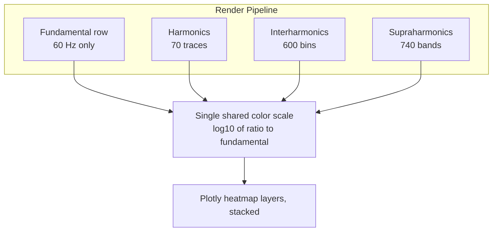

# PQCanvass support for Seeker+

## Overview
Built a multi-resolution frequency-domain spectrogram and added new measure stripcharts for a power quality monitoring web app (PQCanvass), to support a new device platform's (Seeker+) higher resolution data. The spectrogram combines four overlapping data layers: fundamental, harmonics, interharmonics (5 Hz bins), and supraharmonics (200 Hz bands). The work spans the UI, the PHP middle tier, a Python daemon, and a data-processing library.

## My Role
Full-stack ownership of the project. Coordinated with backend developers who were implementing parallel changes in the daemon and the library, but the UI, PHP endpoint, performance optimization across all 4 repos, and the test strategy were my work. 

**Owned end-to-end:**
- Designed and built the spectrogram component using Plotly.js
- Added new measure definitons and per-channel stripchart templates for around 10 new measures
- Built a new middle-tier endpoint for harmonics-style data, including raw response passthrough optimization that cut the per-request latency in half
- Diagnosed and fixed several bugs and regressions.
- Created a comprehensive testing checklist to hand off to other developers and QA testers.

**Coordinated with backend team**
- New path for retrieving harmonic stripchart data from the Python data daemon
- Python and C library work for binary file parsing
- Desing specs and data validation from manager

## Tech Stack
**Frontend:**
- Preact
- Redux + thunk middleware
- Plotly.js for heatmap rendering
- LESS for styling
- Webpack 3.x
- JavaScript ES2019

**Middle tier:**
- PHP (custom internall "Still" framework
- Socket I/O to Python daemon

**Backend (coordinated but didn't own):**
- Python data daemon (custom)
- Python wrapper around a C/Rust library for binary file parsing

**Dev/test tooling:**
- Browser DevTools
- Git history archaeology across 4 repos
- Custom in-app benchmark UI

## The Problem:
The new device platform records power quality data at a significantly higher frequency resolution than legacy devices: 70 individual harmonics, 600 interharmonic 5 Hz bins (5 Hz-3 kHz), and 740 supraharmonic 200 Hz bands (2 kHz-150 kHz). The existing UI handled harmonics well, but was blind to anything above around 3 kHz, and didn't have any way to view them as a heatmap. 
**The ask:** A single view, frequency on Y, time on X, color = magnitude, al four resolution tiers composable (inlcuding the fundamental). Plus all the new device's measures need to graph through the existing stripchart system. 

Three constraints made this harder than a generic visualization problem:

1. **Data volume.** A request for all 740 supraharmonic bands × N time samples per band exceeded the middle-tier daemon's 128 MB memory ceiling on full recording fetches.
2. **Browser limits.** HTTP/1.1 caps simultaneous connections at 6 per origin. Aggressive parallelization didn't actually show much improvement, if any.
3. **No backend yet.** When I started working on this, the daemon's harmonic endpoint didn't exist. UI scaffolding had to be built against synthetic data and integrated as the backend caught up.

## Solution

### Architectural overview

Each interface had to do something *non-obvious* to make the whole pipeline performant.

### Frontend: composing four resolutions into one heatmap

Each of the four data layers (fundamental, harmonics, interharmonics, and supraharmonics) has different bin counts and time resolutions. Instead of trying to combine them into one dataset that could be graphed, I chose to rendereach as a separate Plotly heatmap trace with its own native bin/time resolution and stack them on top of eachother, ensuring the finer data was stacked on top wherever there were overlaps (mainly harmonics and interharmonics). This also had the added benefit of allowing the users to toggle individual layers on and off if they wanted to. 

**Color scale choice.** The voltage magnitudes displayed on this heatmap from V to mV. A linear color scale rendered everything except for the fundamental as the same color. I normalized this by computing each cell's value as `log10(cell_voltage / fundamental_voltage`, which gave a perceptually useful range and let the fundamental sit at 0 as a natural reference.

**Null handling.** Since the real data coming in can have gaps, Plotly heatmaps treat `NaN` cells as transparent and `hoveronaps: false` hid the mouse hover popup on those gaps. 

### Data chunking and down-binning

Even when a full 740 band request didn't hit the daemon's memory ceiling, it would take a very long time to load (5 seconds or more end-to-end). The solution to this was to split each layer's request into N chunks by bin range (y-axis) and send the requests in parallel. This cut the load times nearly in half, but of course, I wanted to go faster. The backend exposed an interesting parameter that I was able to take advantage of called `cthresh`, which would allow me to specify how many points I wanted to get back. I combined this with Plotly's tracking of the graph's width to tell the server how far to down-bin the data so that I got back roughly the same number of `[min, max]` traces as there were pixels on the x-axis. This bounded the response size to no more than what the screen can actually display. That meant a 1000-pixel-wide plot fetches about 1000 pairs per bin regardless of whether the recording was 5 minutes or 5 days long.

Two browser-side feedback loops keep `cthresh` honest:
- A `ResizeObserver` refetches when the plots's pixel width changes (resized browser window)
- a `relayout` handler refetches when the user zooms (narrower time range = denser data per pixel)

Both feedback loops are debounced (400ms) so that rapid resizing or zooming doesn't fire N requests per frame.

**Picking N (the chunk count).** Conceptually, more chunks = smaller per-request payloads = better parallelism. In practice, the 6-connection cap with HTTP/1.1 and per-request overhead in the daemon set an efficiency floor. To find the optimal balance of chunk-size and number of chunks, I built a temporary in-app benchmark utility that would capture a consistent zoom range and allow me to re-run the requests with different chunk counts and log the wall clock time, and chunk size for each. Across 15 chunk counts for 2 different zoom levels, the wall-clock time formed a noisy U-curve with fast improvement from 1 to 3 chunks, then a plateau, with 7 chunks marginally best on the combined median. Admitedly, my testing could have been more thorough, but 7 chunks gave acceptable load times, and changing it in the future is as easy as editing a constant at the top of the file. 
